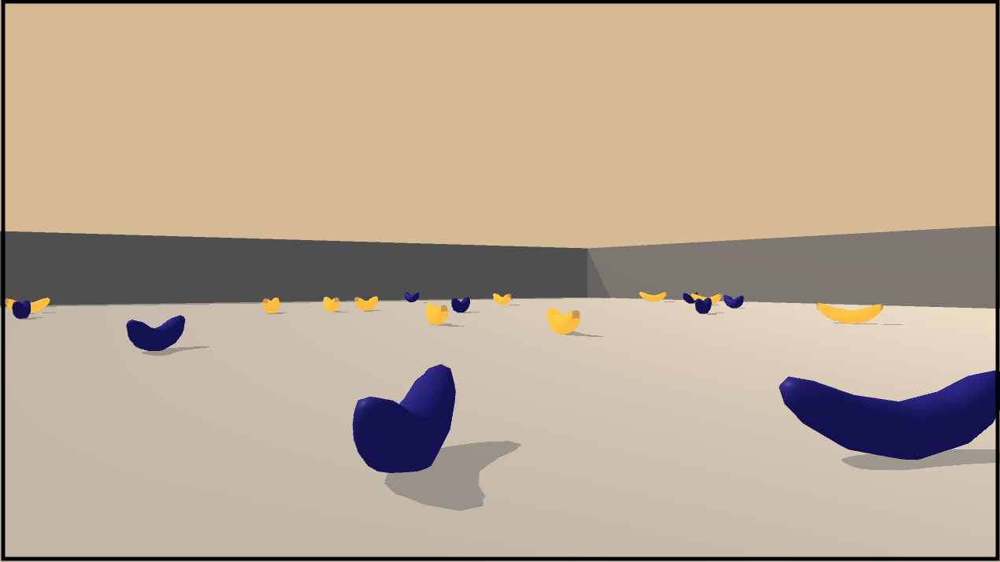

 

# **Project 1: Navigation** 

The goal of this project is to teach an autonomous agent to collect yellow bananas, while avoiding blue bananas.



It is a part of the Udacity nanodegree Deep Reinforcement Learning. 

---

### Problem Setup

##### Environment
The environment consists of a fenced 3D world full of yellow and blue bananas. 

##### Rewards
The reward function is:   
`0` for moving around.  
`+1` for each yellow banana collected.   
`-1` for each blue banana collected.  

##### Goal
The goal of the agent is to maximize episodic reward. Each episode is 300 time steps long, and the task is considered solved if the average reward over 100 episodes is at least `+13`.

##### Observation Space
The agent observes the environment using a sensor yielding a `37`-dimensional vector that includes for instance velocity and ray-based perceptions of objects in the forward direction. Thus, the observation space in continuous.

##### Action Space
There are four actions available to the agent:  
`0 = Walk forward`  
`1 = Walk backward`  
`2 = Turn left`  
`3 = Turn right`  

---

### The Banana Collection Agent

##### Implementation
The banana collection agent is implemented and trained in the Jupyter notebook `Navigation.ipynb`.  
The weights of a trained agent are stored in `banana_collector.pth`.

##### Description
The details of the banana collection agent is described in `Report.md`. 

---

### Getting Started

To train the agent described in the notebook, follow this instruction (MacOS):

1. Create a new virtual environment running Python 3.6:
```
$ conda create -n <my_env_name> python==3.6 
```

2. Activate virtual environment:
```
$ source activate <my_env_name>
```

3. Install dependencies (use specific version combo below):
```
$ conda install scipy
$ pip install tensorflow==1.7.1
$ pip install torch==0.4.0
$ pip install mlagents=0.4.0
```

4. Download BananaEnvironment [here](https://s3-us-west-1.amazonaws.com/udacity-drlnd/P1/Banana/Banana.app.zip) and unzip it. 

5. Start Jupyter Notebook server:
```
$ jupyter notebook
```

6. Run notebook `Navigation.ipynb`