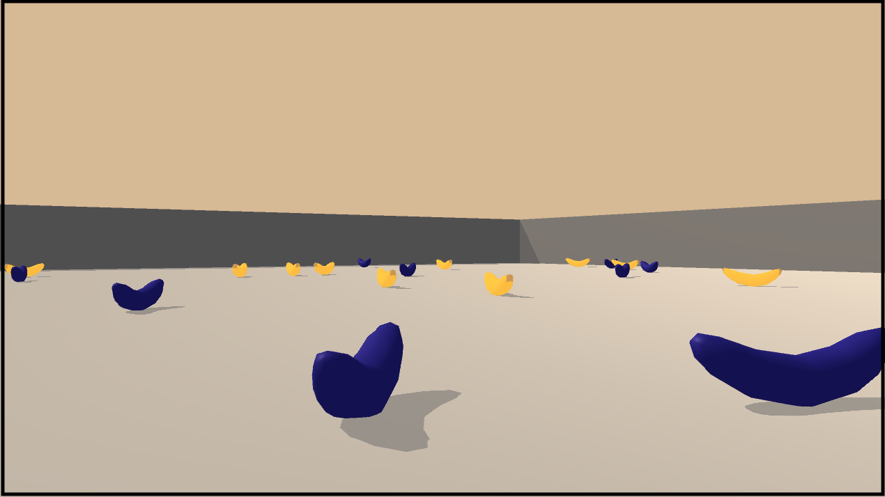
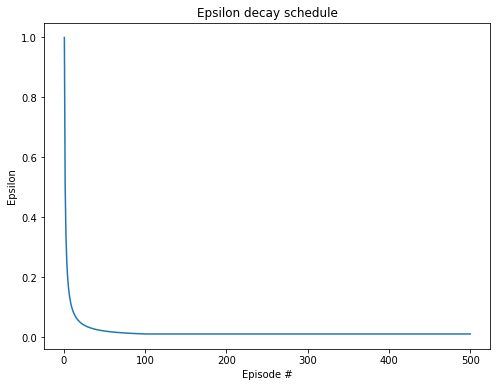
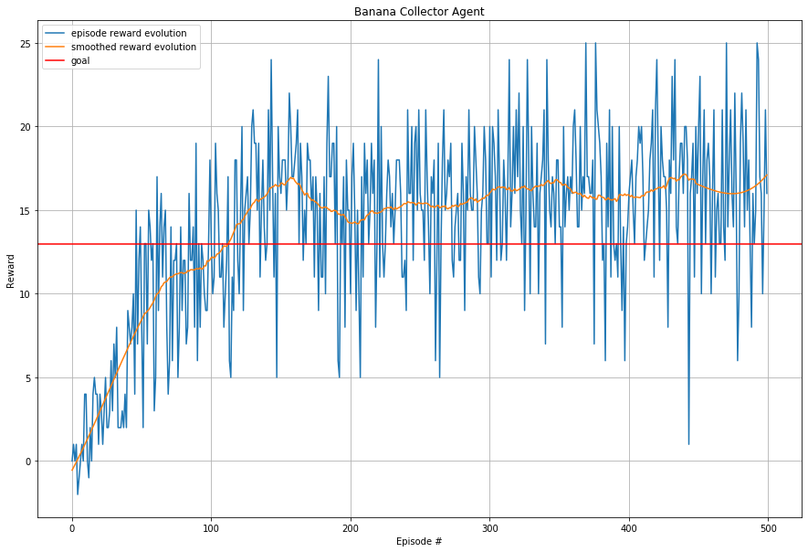

 

# **Project 1: Navigation** 

The goal of this project is to teach an autonomous agent to collect yellow bananas, while avoiding blue bananas.

It is a part of the Udacity nanodegree Deep Reinforcement Learning. 

---

### Problem Setup

##### Environment
The environment consists of a fenced 3D world full of yellow and blue bananas. 

##### Rewards
The reward function is:   
`0` for moving around.  
`+1` for each yellow banana collected.   
`-1` for each blue banana collected.  

##### Goal
The goal of the agent is to maximize episodic reward. Each episode is 300 time steps long, and the task is considered solved if the average reward over 100 episodes is at least `+13`.

##### Observation Space
The agent observes the environment using a sensor yielding a `37`-dimensional vector that includes for instance velocity and ray-based perceptions of objects in the forward direction. Thus, the observation space in continuous.

##### Action Space
There are four actions available to the agent:  
`0 = Walk forward`  
`1 = Walk backward`  
`2 = Turn left`  
`3 = Turn right`  

---

### Agent Learning Algorithm

##### Q-Learning
The agent uses a value-based method called Q-learning to learn its task. Classic Q-learning is a model-free online learning algorithm in the temporal-difference (TD) familiy. The agent uses the estimated action-values  ("Q-values") in each state to derive its policy. As opposed to some other TD-algorithms, it is learning "off-policy", i.e. the agent acts according to a certain behavioural policy (typically ε-greedy) to allow for some exploration, but the update targets are calculated using another policy. In Q-learning that policy is an always greedy one. 

##### Deep Q-Network (DQN)
Since the observation space is continuous in this environment, generalization to states not encountered during training is an important aspect to consider. Thus, rather than using a look-up table for action-values, it makes sense to use a function approximator to map states to Q-values. A neural network is a good candidate to approximate Q-values, since it can represent complex non-linear functions. States are mapped to Q-values for all possible actions at once with a single forward pass through the network.

Training of neural networks assumes that the experience samples used as input are independent and identicaly distributed (IID). In sequential problems however, environment states are correlated. Another issue arising when using a function approximator to estimate Q-values is that the targets _r + γ*maxa' Q(s', a')_ used in training updates are dependent on the network parameters _w_. This creates a moving target that can lead to training oscillations or even divergence. The _DQN algorithm_[1] introduces two new concepts to mitigate these issues - experience replay and fixed Q-targets.

##### Experience Replay
The agent is fitted with a memory where it can store experiences from the environment:

| Experience Memory |
|:------------------|
| \{ _St, At, Rt+1, St+1, &lt;Done&gt;_ \} | 
| \{ _St+1, At+1, Rt+2, St+2, &lt;Done&gt;_ \} |
| ... |

where _&lt;Done&gt;_ is an indicator on whether the episode finished or not. 

Rather than learning online, the agent stores experiences in the memory. Every once in a while, the agent randomly samples a mini-batch of collected experiences from the memory and use them in training the Q-value approximator. Besides de-correlation of experiences, this procedure also has other benefits. The agent can learn cross-episode and multiple times from each experience, which can be extra useful for unusual states and costly actions. Mini-batches also lower the gradient variance, compared to updating using a single experience as in the online setting. 

##### Fixed Q-Targets
To alleviate the issue of moving targets, two identical neural networks are used. The main one is trained to approximate the action-value function, but the update targets are computed using the second network, where weights are held fixed during training. Occasionally, the weights of the value network are cloned to the target network. Rather than copying the entire weight set every _n_ steps however, a "soft update" technique can be used to avoid abrupt jumps in Q-targets: 

_w- <- τ*w- + (1-τ)w_

where _w-_ is the weights of the target network and _w_ is the weight of the value network. The hyperparameter τ controls the interpolation rate. 

The setup with interleaving experience sampling and learning using fixed Q-targets also introduces three other hyperparameters: how long to sample experiences before learning from it, how many samples to train on, and how often to update the Q-target network parameters.

---

### Agent Implementation
This section outlines some structural choices of the agent. For specific settings of hyperparameters, see [below](#hyperparameters).

##### Action-Value Estimator
As mentioned, the agent observes the Banana Environment using sensors yielding a 37-dimensional state vector. Thus, there is no need to use convolutions in the neural network used as action-value estimator. Instead, a standard neural network is used where neurons are activated with ReLU functions, except in the output layer where the raw logits are used as Q-value estimates.

##### Behavioural Policy
In this agent, the behavioural policy is ε-greedy. With probability ε a random action is choosen, in all other cases the agent picks the greedy action. In this manner, the agent sometimes performs exploration of the environment. 

---

### Agent Training

##### Approach
A major difficulty when comparing algorithms and hyperparameter settings is the fact that training episodes are not fully reproducible. Even if random parts of the algorithms, such as neural network weight initialization, ε-greedy action selection, and so on are seeded, the physics of the Banana Environment still contains random elements. 

One approach to hyperparameter tuning in these circumstances would be to evaluate the average scoring of several differently seeded agents, each being trained several times. However, since the [goal](#goal) was defined as achieving an average reward of +13 over 100 episodes as quickly as possible (rather than to for instance achieve the highest long-term return, or generalization to other collection environments), the decision was taken to train using a single run of a single agent. This will probably not result in optimal hyperparameter settings, but at least the 100 epsiode average will indicate that the task was indeed solved consistently and not mainly due to luck with random environment physics (e.g. that 13 bananas happend to be generated just in front of the agent). Also, even when the agent has reach the goal, training continues for additional episodes, to make sure it continues to learn to some extent. A more thorough investigation of agent statistics is postponed as [Future Work](future-work).

Another issue is the potential overfitting of the agent. This is rather likely to occur to some extent. It is hard to tell how much, since we do not have access to a "test set" with which to evaluate generalization to other environments. The physics randomness mentioned above at least does not allow the agent to just memorize a complete action sequence. So in this aspect the randomness works in our favour! 

##### Hyperparameters
With the caveats mentioned in [Approach](#approach) in mind, agent hyperparameters where tuned in the following manner.

The neural networks used to estimate Q-value was configured with two hidden layers of 32 neurons each:

| Layer | Dimensions | Activation Function |
| :----------------- | :------------ | :----------- |
| Fully-connected | 37 -> 32 | ReLU
| Fully-connected | 32 -> 32 | ReLU
| Fully-connected | 32 -> 4 | N/A 

In this particular environment, observations are low-dimensional and quite information-rich. Also, both positive and negative rewards are frequent (each banana collected). Thus, extensive exploration of the environment is probably of less importance to solve the tasj, so ε was set to decay on a rather aggressive schedule as _1/#episodes_: 

For the other hyperparameters, different combinations of values was tried informally. The model was eventually trained with these values:

| Hyperparameter | Value | Description |
|:------------------|------------|-----------|
| MEMORY_SIZE | 25000 | Size of Experience Memory 
| BATCH_SIZE | 64 | Size of mini-batch used for training 
| LEARN_EVERY | 1 | Number of experiences between learning
| LEARN_BATCHES | 1 | Number of batches to learn from before resuming experience collection
| TARGET_UPDATE_EVERY | 1 | Number of experiences between updating Q-targets
| GAMMA | 0.999 | Reward discount factor
| LR | 0.0003 | Optimizer learning rate
| TAU | 0.999 | Soft update interpolation factor for Q-targets

An interesting observation is the fact that quick updates performs best (at least for the chosen goal). One interpretation is that the soft update rule of updating Q-targets is a very good alternative.

##### Loss Function
The network was trained with the `Adam Optimizer`. In the original DQN paper[1], MSE loss was used with errors clipped to within [-1, 1], since they can be quite large. Here, the [Huber loss](https://en.wikipedia.org/wiki/Huber_loss) was used instead to add some robustness. It is quadratic for small errors, but less steep (linear) for large ones. 

---

### Agent Evaluation

##### Reward Evolution
The evolution of episodic rewards received by the agent is recorded in order to determine when the goal is fulfilled:

As can be seen in the figure above, the episodic score is quite noisy, so a smoothed version is also supplied (using a [Savitzky–Golay filter](https://en.wikipedia.org/wiki/Savitzky–Golay_filter) with a window of 101).

In this particular run, the agent solved the task after `155` episodes, but training continued for 500 episodes. In the end, the agent has an average score above 16. See further details in the notebook `Navigation.ipynb`.

---

### Future Work
Listed here are some extensions to the problem that would be interesting to pursue in the future.

##### Hyperparameter Tuning
A more systematic search should be performed to find better hyperparameter values, e.g. using grid search or random search. Preferably, this should be evaluated by using average scoring from differently seeded agents over many training runs (as discussed in [Approach](#approach) above), and perhaps with the goal of reaching the highest average score in the long run, rather than reaching a certain level quickly.  

##### Known DQN Improvements
A number of improvements to DQNs have been suggested, such as Prioritized Experience Replay[2] and Dueling Q-networks[3]. It should be investigated if/how these techniques could improve results on this particular task as well. 

##### Vision-Based Learning
There is another version of the Banana Environment in which the agent observations are just the pixels of its camera. Thus, the setting is more similar to the original work using DQNs in Atari-playing agents[1]. This would be a harder task to solve, since the dimensionality of the state increases significantly. The agent would have to be fitted with a bigger neural network and include convolutions. An interesting challenge to try out!

---

### References
[1] Mnih, et al. 2015 ['Human-level control through deep reinforcement learning'](https://storage.googleapis.com/deepmind-media/dqn/DQNNaturePaper.pdf) _Nature_, vol. 518(7540), pp. 529–533  
[2] Schaul, et al. 2015 ['Prioritized Experience Replay'](https://arxiv.org/abs/1511.05952) _arXiv_:1511.05952  
[3] Wang, et al. 2015 ['Dueling Network Architectures for Deep Reinforcement Learning'](https://arxiv.org/abs/1511.06581) _arXiv_:1511.06581
