 

# **Project 2: Continuous Control** 

The goal of this project is to teach an autonomous agent with a double-jointed arm to keep its hand in a moving target location for as long as possible. 

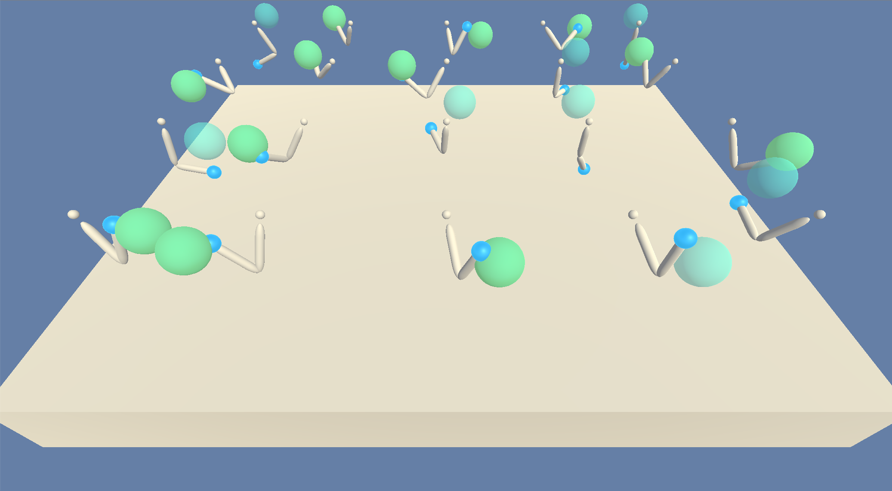

It is a part of the Udacity nanodegree Deep Reinforcement Learning. 

---

### Problem Setup

##### Environment
The environment consists of a double-jointed arm and a moving target location. There is also a correpsonding training environment where the agent have 20 parallel workers to collect experiences faster.

##### Rewards
The reward function is:   
`0` for moving the arm.  
`+0.1` for each timestep the hand is kept in the moving target location.

##### Goal
The goal of the agent is to maximize episodic reward. The task is considered solved if the average reward over 100 episodes is at least `+30`.

##### Observation Space
The agent observes the environment using a sensor yielding a `33`-dimensional vector that includes position, rotation, velocity, and angular velocities of the arm. Thus, the observation space is continuous.

##### Action Space
To control the arm the agent applies torques to each joint, resulting in a `4`-dimensional vector. Thus, the action space is also continuous.

---

### Agent Learning Algorithm

##### Policy-Based Methods
The agent uses a policy-based method to learn its task. This means that instead of estimating a value function and derive the policy from it, a function approximator is used to represent the policy directly. Besides simplicity, this approach can learn true stochastic policies, which for some problems is the optimal behaviour. Most often, the function approximator is a neural network mapping state vectors to an action probability distribution:

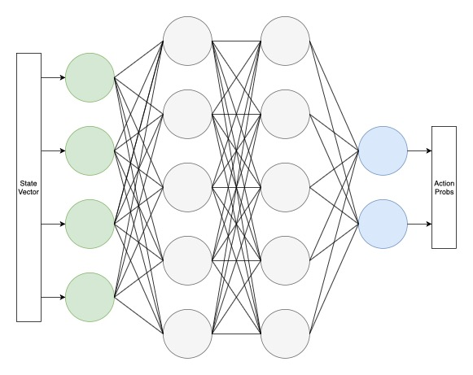

Another benefit of policy-based methods is that they can be used in continuous action spaces, which is exactly what we have in this case. To accomplish this, the output layer have one node for each action. The output is then interpreted as a parameterized multivariate distribution, e.g. a Gaussian. Actions magnitudes are sampled from the distribution. This also provides the way the agent is exploring the environment.

##### Policy Gradients
Mathematically, we can formulate the learning problem as finding weights of the function approximator such that the agent experiences trajectories with high returns:

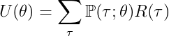

We can then learn the weights *θ* using stochastic gradient ascent. The gradient estimate has the form:

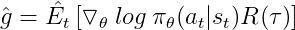

where *πθ* is a stochastic policy and *R(τ)* the total reward of the trajectory.

The basic algorithmic idea is for the agent to collect some trajectories in the environment. These experiences are used to estimate the policy gradient, which in turns is used to update the policy network. However, using a small number of sampled trajectories typically leads to a very noisy estimate of the gradient. Trajectory returns can also have a high variance in many problems, further destabilizing training. Besides the robustness problems, the method also suffers from sample inefficiency. Stochastic gradient ascent updates intrinsically need "on-policy" data, i.e. we can not reuse already collected trajectories. Different approaches have been proposed to come to term with these issues.

##### Actor/Critics
Actor/Critics is a family of algorithms that replace the use of empirical returns with a value-based estimator as baseline to reduce the variance of pure policy-based methods. The principal architecture of an actor/critic is to use two neural networks. One estimates the policy and the other one the value of the state. Training is performed according to the following outline: 

1. Agent collects a set of trajectories using current policy
2. Critic is updated with the TD-estimate:

    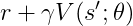

3. Actor is updated with stochastic gradient ascent, in this case using the advantage function as a baseline:

    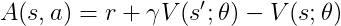

If the value function estimator (the *"critic"*) learns using TD-estimates, it only looks ahead a few steps which can balance the high variance of the policy network (the *"actor"*), especially when trajectories are long and/or rewards are sparse. It comes at a cost of bias however. One popular method of limiting the bias is to use Generalized Advantage Estimation (GAE)[2], which uses a TD(λ)-style approach to estimate *Ât*.

##### Proximal Policy Optimization (PPO)
Proximal Policy Optimization (PPO) was proposed by Schulman et. al.[1]. It uses a variant of the actor/critic architecture. Since features useful for deciding which actions to take in each state should be very similar to those useful for estimating the value of the same state, network parameters can be shared. This means that we get an architecture in which there is a common "body", but different "heads" for the actor and the critic:

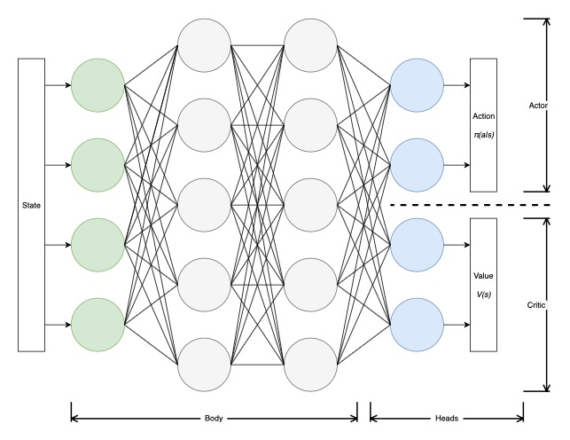

The objective function used in training of the joint network is accordingly constructed of three different terms: policy updates, value function updates and an entropy bonus.

For the policy updates, importance sampling can be used to compute the gradient estimate for a new policy. This allow us to reuse sampled trajectories even after updating the policy weights for several epochs. However, the old and new policy should be "near" each other for it to be feasable. To encourage this, we add clipping to the objective. The result is:

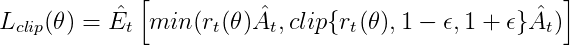

where rt(θ) is the policy ratio, Ât the estimate of the advantage and ε is a hyperparameter determining how much to clip. Refer to [1] for more details.

Values are updated by minimizing the squared error loss between estimated values and (discounted) sampled returns:

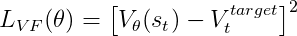

Finally, an entropy bonus *H* is added to encourage exploration. The total objective function to maximize becomes:

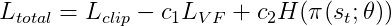

where *c1* and *c2* are hyperparameters. 

---

### Agent Implementation
This section outlines some structural choices of the agent. For specific settings of hyperparameters, see [below](#hyperparameters).

##### Actor/Critic
If we assume that actions are uncorrelated, they can be represented by a multivariate Gaussian with a diagonal covariance matrix. The critic head of the neural network outputs the mean vector, and the standard deviations are added separately as learnable parameters: 

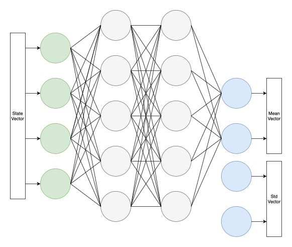

---

### Agent Training

##### Approach
A major difficulty when comparing algorithms and hyperparameter settings is the fact that training episodes are not fully reproducible. Even if random parts of the algorithms, such as neural network weight initialization, ε-greedy action selection, and so on are seeded, the physics of the double-jointed arm environment still contains random elements. 

One approach to hyperparameter tuning in these circumstances would be to evaluate the average scoring of several differently seeded agents, each being trained several times. However, since the [goal](#goal) was defined as achieving an average reward of +30 over 100 episodes as quickly as possible (rather than to for instance achieve the highest long-term return, or generalization to other collection environments), the decision was taken to train using a single run of a single agent. This will probably not result in optimal hyperparameter settings, but at least the 100 epsiode average will indicate that the task was indeed solved consistently and not mainly due to luck with random environment physics. Also, even when the agent has reached the goal, training continues for additional episodes, to make sure it continues to learn to some extent. A more thorough investigation of agent statistics is postponed as [Future Work](future-work).

Another issue is the potential overfitting of the agent. This is rather likely to occur to some extent. It is hard to tell how much, since we do not have access to a "test set" with which to evaluate generalization to other environments. The physics randomness mentioned above at least does not allow the agent to just memorize a complete action sequence. So in this aspect the randomness works in our favour! 

##### Parallelism
To increase the number of trajectories collected by the agent, the environment variant with 20 independent workers is used.

##### Hyperparameters
With the caveats mentioned in [Approach](#approach) in mind, agent hyperparameters where tuned in the following manner.

The neural network body was configured with two hidden layers of 512 neurons each:

| Layer | Dimensions | Activation Function |
| :----------------- | :------------ | :----------- |
| Fully-connected |  33 -> 512 | ReLU
| Fully-connected | 512 -> 512 | ReLU

The actor head maps the output from the last hidden layer to the 4-dimensional action vector:

| Layer | Dimensions | Activation Function |
| :----------------- | :------------ | :----------- |
| Fully-connected | 512 -> 4 | tanh 

The critic head map the output from the last hidden layer to the state value:

| Layer | Dimensions | Activation Function |
| :----------------- | :------------ | :----------- |
| Fully-connected | 512 -> 1 | N/A 

For the other hyperparameters, different combinations of values was tried informally. The model was eventually trained with these values:

| Hyperparameter | Value | Description |
|:------------------|------------|-----------|
| TRAJECTORY_HORIZON | 2048 | Length of collected trajectories 
| SGD_EPOCHS | 5 | Number of epochs to train the network before resuming trajectory collection 
| BATCH_SIZE | 256 | Size of mini-batch used for training 
| LR | 0.0005 | Optimizer learning rate
| MAX_GRADIENT | 3.0 | Clip gradients to this maximum value
| GAMMA | 0.99 | Reward discount factor
| LAMBDA | 0.95 | GAE trace decay
| MAX_RATIO | 0.3 | Clip policy ratios to this maximum value
| VALUE_FCN_COEFF | 0.5 | Coefficient for the value function part of the objective function
| ENTROPY_COEFF | 0.01 | Coefficient for the entropy bonus part of the objective function

##### Loss Function
The network was trained with the `Adam Optimizer`.

---

### Agent Evaluation

##### Reward Evolution
The evolution of episodic rewards received by the agent is recorded in order to determine when the goal is fulfilled:

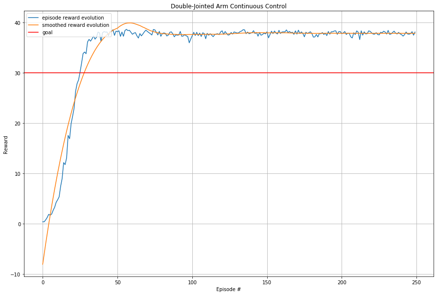

As can be seen in the figure above, training is quick and remarkably stable. A smoothed version of the scores is also supplied (using a [Savitzky–Golay filter](https://en.wikipedia.org/wiki/Savitzky–Golay_filter) with a window of 101). In this particular run, the agent solved the task after `92` episodes, but training continued for 250 episodes. In the end, the agent has an average score around 38. See further details in the notebook `Continuous_Control.ipynb`.

Now, the definition of "solved" is that the mean reward over 100 episodes (and all agent workers) is > 30.0. Thus, the shortest time to solve the task is perhaps by defintion 100. In any case, the average score is well above 30 for all remaining episodes. Interesting is also the fact that average single epsiode score passes 30 already around episode 25 - very fast learning! 

Another note is that an episode is technically 1000 timesteps long in the environment, but the trajectory horizon is set to 2048. Thus, the agent workers are able to gather more data each loop and thus train faster. Since the goal is defined in terms of episodes however, this should perhaps be considered "cheating", since basically two episodes are run at once. But one can also view it as 40 workers, so this run is still the submitted one. Capping the horizon at one full episode (keeping the other hyperparameters fixed) increased the "solved episode" to about 120, whereas increasing it to 4096 made the agent solve the task even faster, at 81 episodes.

##### Policy Evaluation
After completed training, the agent was evaluated in the other environment variant with only one worker. As expected, it scores around 38.

---

### Future Work
Listed here are some extensions to the problem that would be interesting to pursue in the future.

##### Hyperparameter Tuning
A more systematic search should be performed to find better hyperparameter values, e.g. using grid search or random search. Preferably, this should be evaluated by using average scoring from differently seeded agents over many training runs (as discussed in [Approach](#approach) above), and perhaps with the goal of reaching the highest average score in the long run, rather than reaching a certain level quickly.  

##### Algorithmic Comparison
There are many policy-gradient algorithms, so it would be interesting to conduct a comparison of different approaches. For instance, Deep Deterministic Policy Gradiets (DDPG)[3] can be thought of as an extension of deep Q-learning to continuous action spaces. Thus, in contrast to PPO it is an off-policy method. How would solving the double-jointed arm environment differ between the algorithms?

---

### References
[1] Schulman, et al. 2017 ['Proximal Policy Optimization Algorithms'](https://arxiv.org/pdf/1707.06347.pdf) _arXiv_:1707.06347  
[2] Schulman, et al. 2015 ['High-Dimensional Continuous Control Using Generalized Advantage Estimation'](https://arxiv.org/pdf/1506.02438.pdf) _arXiv_:1506.02438  
[3] Lillicrap, et al. 2015 ['Continuous Control with Deep Reinforcement Learning'](https://arxiv.org/pdf/1509.02971v2.pdf) _arXiv_:1509.02971  
