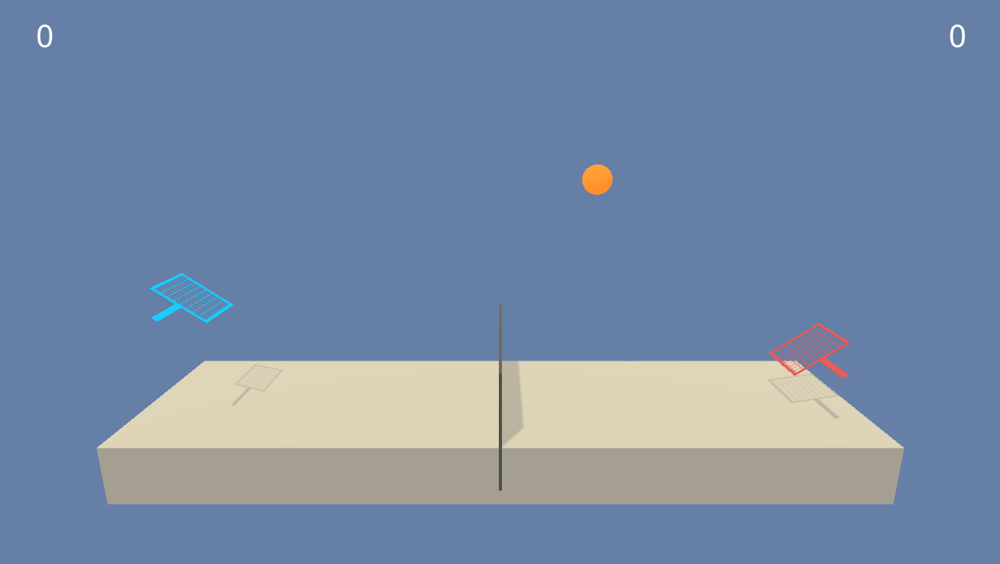

 

# **Project 3: Collaboration and Competition** 

The goal of this project is to teach two autonomous agents to play collaborative tennis, i.e. keeping the ball in play for as long as possible.



It is a part of the Udacity nanodegree Deep Reinforcement Learning. 

---

### Problem Setup

##### Environment
The environment consists of two agents controlling a racket each.

##### Rewards
The reward function is:   
`0` for moving around on the court.  
`+0.1` for hitting the ball over the net.  
`-0.01` for dropping the ball or hitting it out of bounds.

Given the collaborative nature of the task, the episodic reward is defined as the maximum reward received by an agent.

##### Goal
The goal of the agents is to maximize episodic reward by collaborating to keep the ball in play. The task is considered solved if the average reward over 100 episodes is at least `+0.5`.

##### Observation Space
Each agent independently observes the environment using a sensor yielding a localized `8`-dimensional vector that includes the position and velocity of the ball and racket. Thus, the observation space is continuous. To be able to determine ball direction, the agents collect three consecutive frames of observations, resulting in a `24`-dimensional vector.

##### Action Space
Agents can move towards/away from the net, as well as jump. This results in a `2`-dimensional vector. Thus, the action space is also continuous.

---

### The Tennis Playing Agents

##### Implementation
The tennis playing agents are implemented and trained in the Jupyter notebook `Tennis.ipynb`.  
The weights of a trained agent are stored in `tennis_player.pth`.

##### Description
The details of the tennis playing agents can be found in `Report.md`. 

---

### Getting Started
To train the agents described in the notebook, follow this instruction (MacOS):

1. Create a new virtual environment running Python 3.6:
```
$ conda create -n <my_env_name> python==3.6 
```

2. Activate virtual environment:
```
$ source activate <my_env_name>
```

3. Install dependencies (use specific version combo below):
```
$ conda install scipy
$ pip install tensorflow==1.7.1
$ pip install torch==0.4.0
$ pip install mlagents=0.4.0
```

4. Download Tennis Environment [here](https://s3-us-west-1.amazonaws.com/udacity-drlnd/P3/Tennis/Tennis.app.zip) and unzip it. 

5. Start Jupyter Notebook server:
```
$ jupyter notebook
```

6. Run notebook `Tennis.ipynb`