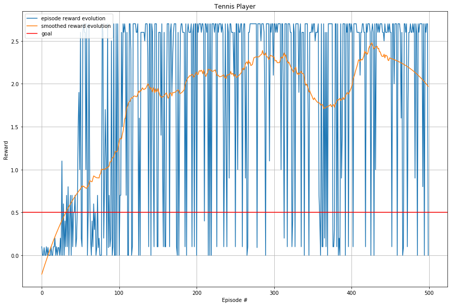
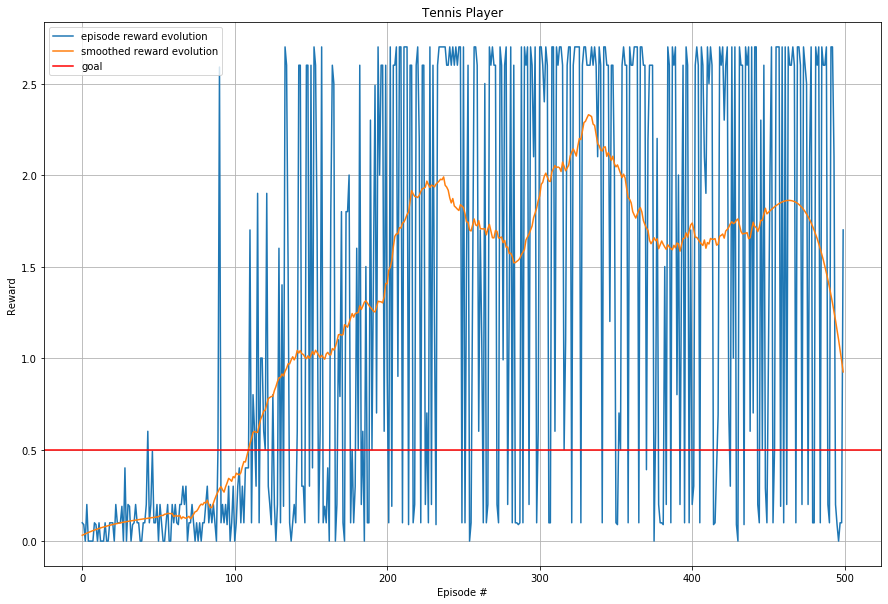

 

# **Project 3: Collaboration and Competition** 

The goal of this project is to teach two autonomous agents to play collaborative tennis, i.e. keeping the ball in play for as long as possible.

It is a part of the Udacity nanodegree Deep Reinforcement Learning. 

---

### Problem Setup

##### Environment
The environment consists of two agents controlling a racket each.

##### Rewards
The reward function is:   
`0` for moving around on the court.  
`+0.1` for hitting the ball over the net.  
`-0.01` for dropping the ball or hitting it out of bounds.

Given the collaborative nature of the task, the episodic reward is defined as the maximum reward received by an agent.

##### Goal
The goal of the agents is to maximize episodic reward by collaborating to keep the ball in play. The task is considered solved if the average reward over 100 episodes is at least `+0.5`.

##### Observation Space
Each agent independently observes the environment using a sensor yielding a localized `8`-dimensional vector that includes the position and velocity of the ball and racket. Thus, the observation space is continuous. To be able to determine ball direction, the agents collect three consecutive frames of observations, resulting in a `24`-dimensional vector.

##### Action Space
Agents can move towards/away from the net, as well as jump. This results in a `2`-dimensional vector. Thus, the action space is also continuous.

---

### Agent Learning Algorithm

##### Multi-Agent Reinforcement Learning
The Tennis Environment contains a task where two agents must collaborate to keep the ball in play for as long as possible. As each agent adapts its strategy however, the environment appears non-stationary from the perspective of other agents. As a result, the Markov property does not hold for the environment. Since this breaks a convergence requirement of many single-agent learning methods, other techniques must be considered. 

##### Self-play
One obvious approach to the multi-agent setting would be to concatenate all observations made by the agents and train a "super-brain" that outputs all actions of all participating agents. Since the observations of each agent are localized however, it is hard to untangle the true environment state from them. The problem also becomes harder considering the larger joint state/action spaces.

Instead, a naive form of "self-play" will be used. To achieve this, both players independently collect trajectories using its localized observations. All data is then used to train a shared brain that outputs actions, again calculated independently for each agent. This setup will teach the brain to play on both sides of the court, and can thus be used as a form of self-play. The idea is that since each agent is always playing against another one of similar skill level, variance will not spiral out of control despite the non-stationarity. The fact that the action space is limited is also expected to help. 

##### Policy-Based Methods
The agents use a policy-based method to learn its task. This means that instead of estimating a value function and derive the policy from it, a function approximator is used to represent the policy directly. Besides simplicity, this approach can learn true stochastic policies, which for some problems is the optimal behaviour. Most often, the function approximator is a neural network mapping state vectors to an action probability distribution:

Another benefit of policy-based methods is that they can be used in continuous action spaces, which is exactly what we have in this case. To accomplish this, the output layer have one node for each action. The output is then interpreted as a parameterized multivariate distribution. Actions magnitudes are sampled from the distribution. This also provides the way the agent is exploring the environment.

##### Policy Gradients
Mathematically, we can formulate the learning problem as finding weights of the function approximator such that the agent experiences trajectories with high returns:

We can then learn the weights *θ* using stochastic gradient ascent. The gradient estimate has the form:

where *πθ* is a stochastic policy and *R(τ)* the total reward of the trajectory.

The basic algorithmic idea is for the agents to collect some trajectories in the environment. These experiences are used to estimate the policy gradient, which in turn is used to update the policy network. However, using a small number of sampled trajectories typically leads to a very noisy estimate of the gradient. Trajectory returns can also have a high variance in many problems, further destabilizing training. Besides the robustness problems, the method also suffers from sample inefficiency. Stochastic gradient ascent updates intrinsically need "on-policy" data, i.e. we can not reuse already collected trajectories. Different approaches have been proposed to come to term with these issues.

##### Actor/Critics
Actor/Critics is a family of algorithms that replace the use of empirical returns with a value-based estimator as baseline to reduce the variance of pure policy-based methods. The principal architecture of an actor/critic is to use two neural networks. One estimates the policy and the other one the value of the state. Training is performed according to the following outline: 

1. Agent collects a set of trajectories using current policy
2. Critic is updated with the TD-estimate:

    

3. Actor is updated with stochastic gradient ascent, in this case using the advantage function as a baseline:

    

If the value function estimator (the *"critic"*) learns using TD-estimates, it only looks ahead a few steps which can balance the high variance of the policy network (the *"actor"*), especially when trajectories are long and/or rewards are sparse. It comes at a cost of bias however. One popular method of limiting the bias is to use Generalized Advantage Estimation (GAE)[1], which uses a TD(λ)-style approach to estimate *Ât*.

##### Proximal Policy Optimization (PPO)
Proximal Policy Optimization (PPO) was proposed by Schulman et. al.[2]. It uses a variant of the actor/critic architecture. Since features useful for deciding which actions to take in each state should be very similar to those useful for estimating the value of the same state, network parameters can be shared. This means that we get an architecture in which there is a common "body", but different "heads" for the actor and the critic:

The objective function used in training of the joint network is accordingly constructed of three different terms: policy updates, value function updates and an entropy bonus.

For the policy updates, importance sampling can be used to compute the gradient estimate for a new policy. This allow us to reuse sampled trajectories even after updating the policy weights for several epochs. However, the old and new policy should be "near" each other for it to be feasable. To encourage this, we add clipping to the objective. The result is:

where rt(θ) is the policy ratio, Ât the estimate of the advantage and ε is a hyperparameter determining how much to clip. Refer to [2] for more details.

Values are updated by minimizing the squared error loss between estimated values and (discounted) sampled returns:

Finally, an entropy bonus *H* is added to encourage exploration. The total objective function to maximize becomes:

where *c1* and *c2* are hyperparameters. 

---

### Agent Implementation
This section discusses some structural choices of the agent brain implementation. For specific settings of hyperparameters, see [below](#hyperparameters).

##### Input Normalization
Agent observations are not normalized by default in this environment. Since doing so improves training performance, a single layer applying Layer Normalization[3] was added in front of the normal network architecture. A more thorough investigation of how to best regularize the network is left to [future improvements](#network-regularization).

##### Action Distribution
The most common distribution to use when sampling continuous actions is a multivariante Gaussian. In the Tennis Environment however, action values are only defined in the interval [-1, 1]. Since the Gaussian probability density function (PDF) has an infinite support, a bias will be introduced. Any sampled action value outside the interval will be clipped, resulting in an extra probability being assigned to the action value limits (as shown by the shaded areas in the figure below). If the mean of the Gaussian is close to the clipping limit, the bias becomes even larger.

A better option in these cases is the Beta distribution[4]. It has a finite support [0,1], which can then be scaled and shifted to fit the action values of the particular environment. The Beta distribution is parameterized by two parameters _α_ and _β_. Setting _α_ and _β_ _>= 1_ ensures the unimodality and convexity of the distribution. 

---

### Agent Training

##### Approach
A major difficulty when comparing algorithms and hyperparameter settings is the fact that training episodes are not fully reproducible. Even if random parts of the algorithms, such as neural network weight initialization, action selection, and so on are seeded, the physics of the Tennis Environment still contains random elements. 

One approach to hyperparameter tuning in these circumstances would be to evaluate the average scoring of several differently seeded agents, each being trained several times. However, since the [goal](#goal) was defined as achieving an average reward of +0.5 over 100 episodes as quickly as possible (rather than to for instance achieve the highest long-term return, or generalization to other environments), the decision was taken to evaluate agent behaviour using just a single run. This will probably not result in optimal hyperparameter settings, but at least the 100 epsiode average will indicate that the task was indeed solved consistently and not mainly due to luck with random environment physics. A more thorough investigation of agent statistics is postponed as [Future Work](#future-work).

However, given that the task in this particular case is "keeping the ball in play for as long as possible", solving for speed seems pretty irrelevant. A more natural goal would be to optimize for maximum score. Thus, a sort of middle road has been adopted as strategy here. Exploration incentives are kept rather low to bet on early promising strategies and thus solve the task quickly. However, even when the agent has reached the goal, training continues to see what maximum average score is possible to achieve. 

##### Hyperparameters
With the caveats mentioned in [Approach](#approach) in mind, agent hyperparameters where tuned in the following manner.

The neural network body was configured with two hidden layers of 512 neurons each:

| Layer | Dimensions | Activation Function |
| :----------------- | :------------ | :----------- |
| Layer Normalization |  24 -> 24 | N/A
| Fully-connected |  24 -> 512 | ReLU
| Fully-connected | 512 -> 512 | ReLU

The actor head maps the output from the last hidden layer to the 2-dimensional action vector, with an "activation function" of _softplus+1_ to shape the [beta distribution](#action-distribution):

| Layer | Dimensions | Activation Function |
| :----------------- | :------------ | :----------- |
| Fully-connected | 512 -> 2 | softplus + 1

The critic head maps the output from the last hidden layer to the state value:

| Layer | Dimensions | Activation Function |
| :----------------- | :------------ | :----------- |
| Fully-connected | 512 -> 1 | N/A 

For the other hyperparameters, different combinations of values were tried informally. The model was eventually trained with these values:

| Hyperparameter | Value | Description |
|:------------------|------------|-----------|
| TRAJECTORY_HORIZON | 2048 | Length of collected trajectories 
| SGD_EPOCHS | 10 | Number of epochs to train the network before resuming trajectory collection 
| BATCH_SIZE | 256 | Size of mini-batch used for training 
| LR | 0.0005 | Optimizer learning rate
| MAX_GRADIENT | 5.0 | Clip gradients to this maximum value
| GAMMA | 0.995 | Reward discount factor
| LAMBDA | 0.9 | GAE trace decay
| MAX_RATIO | 0.3 | Clip policy ratios to this maximum value
| VALUE_FCN_COEFF | 0.5 | Coefficient for the value function part of the objective function
| ENTROPY_COEFF | 0.003 | Coefficient for the entropy bonus part of the objective function

##### Loss Function
The network was trained with the `Adam Optimizer`. The learning rate was decreased in three steps based on average score (see [Training Variance](#training-variance) section for more information).

---

### Agent Evaluation

##### Reward Evolution
The evolution of episodic rewards received by the agent is recorded in order to determine when the goal is fulfilled (A smoothed version of the scores is also supplied, using a [Savitzky–Golay filter](https://en.wikipedia.org/wiki/Savitzky–Golay_filter) with a window of 101):

In this particular run, the agent solved the task after `59` episodes. Now, the definition of "solved" is that the mean reward over 100 episodes (and all agent workers) is > 0.5. Thus, the shortest time to solve the task is perhaps by defintion 100. In any case, the average score is well above 0.5 for all remaining episodes. 

Despite solving the task as defined by the goal quite quickly, training continued for 500 episodes to also evaluate top scoring capability. In the end, the agent has a 100-episode average score of 2.26 (with a peak around 2.30). This is remarkably higher than the goal, and approaching the maximium score the agents are able to acheive before the episode automatically terminates at 1000 time steps. See further details in the notebook `Tennis.ipynb`. 

Good performance aside, the most striking feature of the reward evolution plot is the dramatic oscillations in episodic scores. They are discussed in more detail below.

##### Training Variance
The run detailed in the supplied notebook `Tennis.ipynb` shows that it is possible to achieve fast learning _and_ high average scores with the same hyperparameter settings. However, a few consecutive runs show that while the agents consistently solve the original goal, it can take significantly longer to reach it. The top score acheived during the 500 episodes also varies. For instance, this run with the same settings did not solve the task until episode 153, peaked at a score of 1.98, and have more frequent sudden score drops:

These high variances in training results are caused by several factors. Besides the already mentioned non-stationarity and random physics issues, there also seem to be another issue with the environment. Even when the agent is performing at its best, episodic scores typically oscillate between max (2.60 - 2.70) and dropping the ball immediately (0.00 - 0.10):

This does not make sense and suggest there is some issue around environment reset. Naturally, a reset causes a discontinuity in data (including two frames of all zeros). Ball and racket states are also initialized randomly. It could be the case that the agent simply has a hard time learning these random discontinuities. It was however not possible to rule out that there is an intrinsic problem with the environment app design. Empirically, resetting the environment clearly yields a discontinuity in observation vectors, but it is at least not visually discernible that balls and rackets return to a "serving" position, or indeed that their position and velocity changes at all. This could be evidence of an environment bug, but to drill deeper the exact dynamics would have to be known.

Assuming that the environment app is correct though, what can be done to combat these variances and give a more consistent training result between runs? The most obvious thing would be to increase training on the reset scenarios. Perhaps the agent overfits on the stable playing from the back of the court? One could also try to regularize the network harder to force it to learn more robust features. Hyperparameters can be tuned to be more defensive (optimize for high scores, not speed of reaching goal), and to follow decaying schedules. 

Systematic implementations of these ideas are postponed to [Future Work](#future-work). Two very crude measures along those lines were however added in the submitted notebook. In an attempt to improve the learning of reset discontinuities, the trajectory collection strategy was altered to end right after a reset. This variable horizon strategy marginally increases reset training data, but keeps the opportunity to collect full episode plays. Some hyperparameters related to training was also decreased at a couple of steps related to average score, but they were rather randomly chosen and without any attempt of tuning. It is unclear if these additions had any stabilizing effect or not, the training variance is still significant and scores still oscillate between max and min. At least lowering the learning rate probably reduced the risk of "catastrophic forgetting" that was commonly seen before adding it (and also present in Udacity benchmark implementation):

---

### Future Work
Listed here are some extensions to the problem that would be interesting to pursue in the future.

##### Training Data
The PPO algorithm enables and improves with parallel collection of trajectories using multiple environments. The supplied environment app did not support parallel exeution however. Also, an investigation into whether the environment reset is correct or not would be worthwhile to confirm/rule out instability being caused by bugs rather than true dynamics. If correct, it would suggest forcing the collection of even more discontinuities, maybe by randomly reseting the environment.

##### Network Regularization
As mentioned in [Input Normalization](#input-normalization), input was normalized to improve training performance. Since the multiagent setting is increasing the training variance in general, it could be fruitful to put more effort into further regularizing the network to force it to learn more robust features. Dropout layers and layer normalizations in between all layers are some techniques that could potentially achieve this. 

##### Hyperparameter Tuning
A more systematic search should be performed to find better hyperparameter values, e.g. using grid search or random search. Preferably, this should be evaluated by using average scoring from differently seeded agents over many training runs (as discussed in [Approach](#approach) above), and with the goal of reaching the highest average score in the long run, rather than reaching a certain level quickly. Especially interesting would be to design a more sophisticated scheme for dynamically adapting hyperparameters during training (learning rate scheduling, entropy decay, etc).

##### Algorithmic Comparison
Besides self-play, there are policy-gradient algorithms designed specifically to deal with the multi-agent case, such as MADDPG[5]. It would be interesting to conduct a comparison of different approaches. 

---

### References
[1] Schulman, et al. 2015 ['High-Dimensional Continuous Control Using Generalized Advantage Estimation'](https://arxiv.org/pdf/1506.02438.pdf) _arXiv_:1506.02438  
[2] Schulman, et al. 2017 ['Proximal Policy Optimization Algorithms'](https://arxiv.org/pdf/1707.06347.pdf) _arXiv_:1707.06347  
[3] Lei Ba, et al. 2016 ['Layer Normalization'](https://arxiv.org/pdf/1607.06450.pdf) _arXiv_:1607.06450  
[4] Chou, et al. 2017 ['Improving Stochastic Policy Gradients in Continuous Control with Deep Reinforcement Learning using the Beta Distribution'](http://proceedings.mlr.press/v70/chou17a/chou17a.pdf) _Proceedings of the 34th International Conference on Machine Learning_, vol. 70, pp. 834--843  
[5] Lowe, et al. 2017 ['Multi-Agent Actor-Critic for Mixed Cooperative-Competitive Environments'](https://papers.nips.cc/paper/7217-multi-agent-actor-critic-for-mixed-cooperative-competitive-environments.pdf) _NIPS'17 Proceedings of the 31st International Conference on Neural Information Processing Systems_. pp 6382-6393

